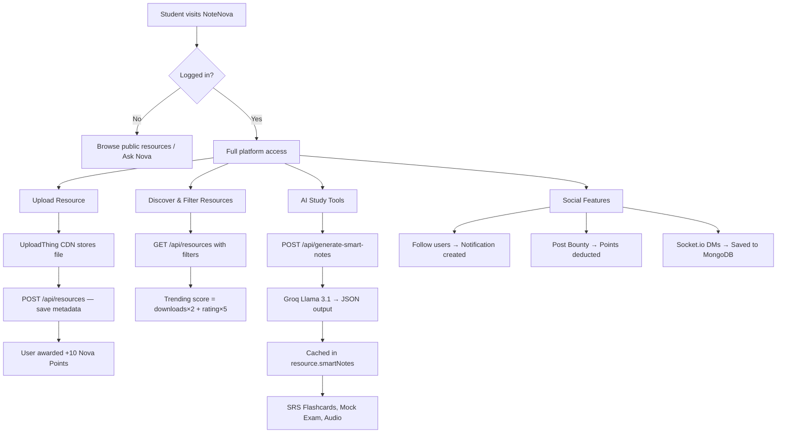
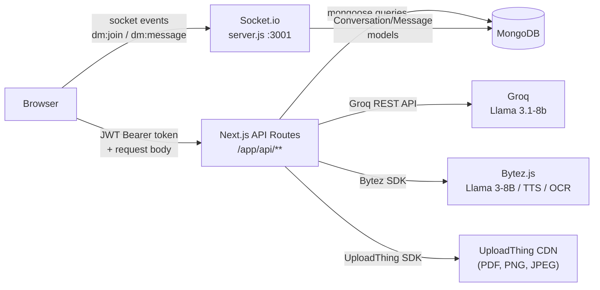
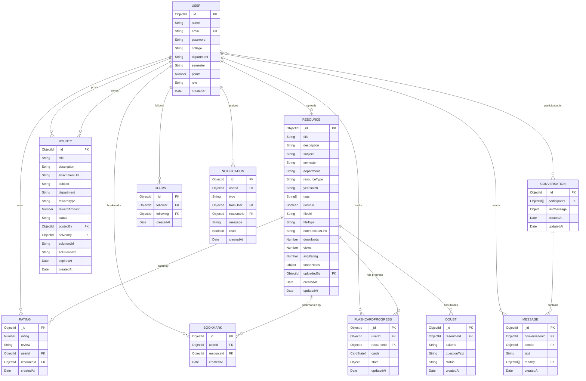
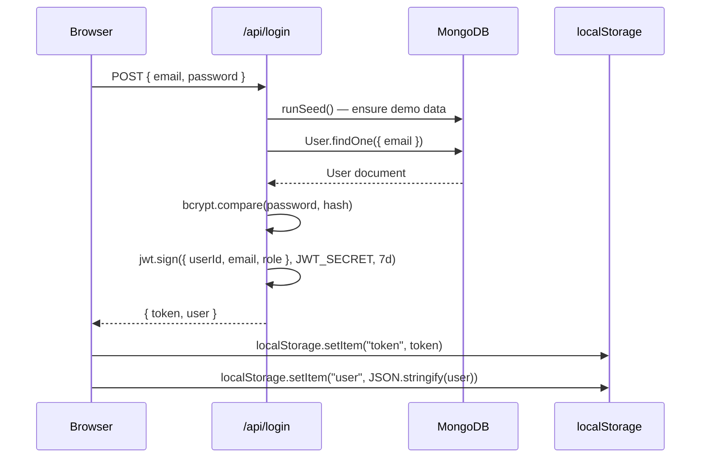
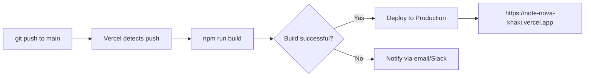

# NoteNova

<div align="center">

**The academic resource-sharing platform built for students, by students.**

*Share notes. Discover more. Earn rewards.*

[](https://nextjs.org/)
[](https://react.dev/)
[](https://www.mongodb.com/)
[](https://tailwindcss.com/)
[](https://socket.io/)
[](https://capacitorjs.com/)
[](https://note-nova-khaki.vercel.app)
[](./LICENSE)

[Live Demo](https://note-nova-khaki.vercel.app) · [Report Bug](https://github.com/sgk18/NoteNova/issues) · [Request Feature](https://github.com/sgk18/NoteNova/issues)

</div>

---

## Table of Contents

1. [Project Overview](#1-project-overview)
2. [Architecture Overview](#2-architecture-overview)
3. [Technology Stack](#3-technology-stack)
4. [Project Structure](#4-project-structure)
5. [File-by-File Documentation](#5-file-by-file-documentation)
6. [Installation Guide](#6-installation-guide)
7. [Environment Variables](#7-environment-variables)
8. [Database Documentation](#8-database-documentation)
9. [API Documentation](#9-api-documentation)
10. [Authentication & Authorization](#10-authentication--authorization)
11. [Core Modules](#11-core-modules)
12. [Frontend Documentation](#12-frontend-documentation)
13. [Backend Documentation](#13-backend-documentation)
14. [Development Workflow](#14-development-workflow)
15. [Testing](#15-testing)
16. [CI/CD Pipeline](#16-cicd-pipeline)
17. [Security Considerations](#17-security-considerations)
18. [Performance Optimizations](#18-performance-optimizations)
19. [Troubleshooting](#19-troubleshooting)
20. [Deployment Guide](#20-deployment-guide)
21. [Future Improvements](#21-future-improvements)
22. [Contributing](#22-contributing)
23. [License](#23-license)

---

## 1. Project Overview

### What is NoteNova?

**NoteNova** is a full-stack academic resource-sharing platform purpose-built for college students. It enables students to upload, discover, and collaboratively learn from academic materials — notes, question papers, solutions, project reports — while being rewarded with a gamified points economy for their contributions.

### Problem Statement

College students routinely struggle with fragmented academic resources: notes shared in personal WhatsApp chats, question papers buried in Google Drive folders, and knowledge siloed within departments and batches. There is no unified, searchable, socially-aware platform that incentivises students to contribute quality material while giving back to the community.

### Business Objective

NoteNova aims to:
- Reduce resource discovery time for students from hours to seconds
- Create a virtuous contribution cycle via a Nova Points economy
- Leverage AI to transform static documents into interactive study tools
- Build a student social graph enabling mentorship and peer learning

### Target Users

| Persona | Use Case |
|---------|----------|
| **Students** | Upload and discover course materials, earn points, get AI-powered study aids |
| **Toppers / Subject Experts** | Earn rewards via the Bounty Board, gain followers |
| **Faculty** | Share notes and question banks with their department |
| **Recruiters / Evaluators** | Assess collaborative and technical competency of contributors |

### Key Features

| Feature | Description |
|---------|-------------|
| 📚 **Resource Library** | Upload/download notes, PDFs, images with full metadata tagging |
| 🤖 **Ask Nova** | AI academic assistant powered by Meta Llama 3 via Groq |
| ✨ **Smart Notes** | AI-generated summaries, flashcards, MCQs, mind maps, and exam questions per resource |
| 🧪 **Mock Exam Simulator** | Auto-generated 20-question exams (MCQ, True/False, Short Answer) with grading |
| 🃏 **SRS Flashcards** | Spaced-repetition system with learning buckets (new → learning → review → mastered) |
| 🎙️ **Audio Overview** | Text-to-speech playback of resource content via Bytez AI |
| 💬 **Live Doubt Chat** | Real-time doubt rooms per resource via Socket.io |
| 📨 **Direct Messages** | Full DM system with read receipts, typing indicators, and online presence |
| 🏆 **Bounty Board** | Post and solve academic bounties with Nova Points or INR rewards |
| 📊 **Leaderboard** | College-wide points ranking to surface top contributors |
| 🔔 **Notifications** | Real-time follow and upload notifications |
| 👤 **User Profiles** | Social follow graph, upload history, points display |
| 🎨 **Multi-Theme** | Three switchable themes: Ion (dark blue), Galaxy (violet), White (minimal) |
| 📱 **Android App** | Capacitor-wrapped PWA pointing at the Vercel deployment |

---

## 2. Architecture Overview

### High-Level Architecture

NoteNova is a **monorepo** that runs two concurrent servers:

```
┌─────────────────────────────────────────────────────────────────┐
│                         CLIENT BROWSER                          │
│              (Next.js App Router + React 19)                    │
└───────────────────┬─────────────────────────┬───────────────────┘
                    │ HTTP/REST                │ WebSocket
                    ▼                          ▼
┌─────────────────────────┐    ┌──────────────────────────────────┐
│  Next.js App (port 3000) │    │  Socket.io Server (port 3001)    │
│  ─ App Router API        │    │  ─ Doubt chat rooms              │
│  ─ 24+ REST endpoints    │    │  ─ DM system (messages+presence) │
│  ─ JWT auth              │    │  ─ Escalation broadcasts          │
│  ─ Cloudinary upload     │    │  ─ Persistent via MongoDB         │
└─────────────────────────┘    └──────────────────────────────────┘
                    │                          │
                    └──────────┬───────────────┘
                               ▼
                ┌──────────────────────────────┐
                │  MongoDB (local/Atlas)        │
                │  Collections: users,          │
                │  resources, conversations,    │
                │  messages, bounties,          │
                │  notifications, follows,      │
                │  bookmarks, ratings,          │
                │  flashcardprogresses, doubts  │
                └──────────────────────────────┘
                               │
              ┌────────────────┼──────────────────┐
              ▼                ▼                   ▼
   ┌──────────────┐  ┌──────────────┐  ┌───────────────────┐
   │  Groq API    │  │  Bytez API   │  │  UploadThing CDN  │
   │  Llama 3.1   │  │  Llama 3 +   │  │  File storage     │
   │  Ask Nova    │  │  TTS + OCR   │  │  (PDF, images)    │
   │  Smart Notes │  │  Mock Exam   │  │                   │
   └──────────────┘  └──────────────┘  └───────────────────┘
```

### System Flow



### Data Flow Diagram



### Application Lifecycle

1. **Request hits** Next.js App Router
2. **`/api/*` routes** call `dbConnect()` — uses singleton cached Mongoose connection
3. On first call, **`runSeed()`** bootstraps demo users & resources if the database is empty
4. **JWT** is extracted and verified on protected routes
5. Business logic executes; AI calls fan out to Groq or Bytez
6. **Response** returns JSON; frontend updates React state
7. **Socket events** for real-time features flow through the separate `server.js` process on port 3001

---

## 3. Technology Stack

### Frontend

| Technology | Version | Purpose | Location |
|-----------|---------|---------|----------|
| Next.js | 16.1.6 | App Router framework, SSR/CSR, routing | `app/` |
| React | 19.2.3 | UI component library | `components/`, `app/` |
| React DOM | 19.2.3 | DOM rendering | Root |
| `@react-three/fiber` | 9.5.0 | Three.js React renderer (particle canvas) | `components/Antigravity.jsx` |
| Three.js | 0.167.1 | WebGL particle simulation | `components/Antigravity.jsx` |
| GSAP | 3.14.2 | Animation library | Various |
| Lucide React | 0.566.0 | Icon library | All UI components |
| `@headlessui/react` | 2.2.9 | Accessible UI primitives | Dropdowns |
| `@heroicons/react` | 2.2.0 | Icon pack | Supplementary icons |

### Backend

| Technology | Version | Purpose | Location |
|-----------|---------|---------|----------|
| Next.js API Routes | 16.1.6 | REST API handlers | `app/api/` |
| Express | 5.2.1 | HTTP server for Socket.io microservice | `server.js` |
| Socket.io | 4.8.3 | Real-time bi-directional events | `server.js`, `hooks/` |
| `bcryptjs` | 3.0.3 | Password hashing | `app/api/login/`, `app/api/register/` |
| `jsonwebtoken` | 9.0.3 | JWT signing & verification | `lib/auth.js` |
| `dotenv` | 17.3.1 | `.env.local` loading in Socket server | `server.js` |

### Database

| Technology | Version | Purpose | Location |
|-----------|---------|---------|----------|
| MongoDB | — | Document database | Cloud / local |
| Mongoose | 9.2.1 | ODM, schema definitions, query building | `models/`, `lib/db.js` |

### Authentication

| Technology | Purpose | Location |
|-----------|---------|----------|
| JWT (jsonwebtoken) | Stateless auth tokens, 7-day expiry | `lib/auth.js` |
| bcryptjs | Password hashing with cost factor 10 | `app/api/login/`, `app/api/register/` |
| `localStorage` | Client-side token + user object storage | Browser |

### State Management

| Technology | Purpose | Location |
|-----------|---------|----------|
| React `useState` / `useEffect` | Local component state | All components |
| React Context (`ThemeContext`) | Global theme state (ion/galaxy/white) | `context/ThemeContext.jsx` |
| `localStorage` | Persisted auth state, TTS position, theme preference | Browser |

### UI Libraries & Styling

| Technology | Version | Purpose | Location |
|-----------|---------|---------|----------|
| Tailwind CSS | v4 | Utility-first CSS | All components |
| `@tailwindcss/postcss` | v4 | PostCSS integration | `postcss.config.mjs` |
| `tw-animate-css` | 1.4.0 | Pre-built Tailwind animations | `app/globals.css` |
| shadcn/ui | 3.8.5 | Radix-based component primitives | Components |
| `radix-ui` | 1.4.3 | Accessible headless UI | Components |
| `class-variance-authority` | 0.7.1 | Variant-based class management | UI components |
| `clsx` + `tailwind-merge` | — | Conditional class merging | Utilities |
| Inter (Google Fonts) | — | Primary typeface | `app/layout.jsx` |

### AI / Third-Party Services

| Service | SDK/API | Models Used | Purpose |
|---------|---------|------------|---------|
| **Groq** | REST (fetch) | `llama-3.1-8b-instant` | Ask Nova, Smart Notes generation |
| **Bytez** | `bytez.js` SDK | `meta-llama/Meta-Llama-3-8B-Instruct` | Study material generation (notes, flashcards, quiz) |
| **Bytez** | `bytez.js` SDK | `meta-llama/Meta-Llama-3-8B` | Mock exam generation |
| **Bytez** | `bytez.js` SDK | `facebook/mms-tts-eng` | Text-to-speech audio |
| **Bytez** | `bytez.js` SDK | `kkatiz/THAI-BLIP-2` | Image-to-text (OCR) |
| **UploadThing** | `@uploadthing/react` | — | File upload CDN (PDF, images) |
| **Cloudinary** | HTTP API | — | Secondary image hosting |

### Mobile

| Technology | Version | Purpose |
|-----------|---------|---------|
| Capacitor | 8.1.0 | Android app shell wrapping the Vercel deployment |
| `@capacitor/status-bar` | 8.0.1 | Native status bar styling |
| `@capacitor/android` | 8.1.0 | Android target |

### DevOps & Tooling

| Tool | Purpose |
|------|---------|
| ESLint 9 + `eslint-config-next` | Code linting |
| Vercel | Production deployment |
| `jsconfig.json` | Path alias `@/` → project root |

---

## 4. Project Structure

```
NoteNova/
│
├── app/                          # Next.js App Router root
│   ├── globals.css               # Global CSS, three themes, animations
│   ├── icon.png                  # App icon
│   ├── layout.jsx                # Root layout — fonts, metadata, providers
│   ├── page.jsx                  # Home page — resource feed + hero
│   │
│   ├── api/                      # All REST API route handlers
│   │   ├── ask-nova/             # POST — AI academic Q&A via Groq
│   │   ├── audio-overview/       # Text-to-speech via Bytez
│   │   ├── bookmark/             # GET/POST/DELETE bookmark management
│   │   ├── bounty/               # GET/POST bounties; solve bounty endpoint
│   │   ├── dm/                   # DM system REST layer
│   │   │   ├── conversations/    # GET/POST conversations
│   │   │   ├── messages/         # GET messages per conversation
│   │   │   ├── read/             # Mark messages read
│   │   │   └── users/            # DM user discovery
│   │   ├── doubt/                # Doubt creation/listing per resource
│   │   ├── follow/               # GET/POST follow/unfollow + counts
│   │   ├── generate/             # POST — Bytez LLM content generation
│   │   ├── generate-smart-notes/ # POST — Groq full Smart Notes object
│   │   ├── image-to-text/        # POST — Bytez OCR (BLIP-2)
│   │   ├── leaderboard/          # GET top 50 users by points
│   │   ├── login/                # POST — authenticate + JWT + seed
│   │   ├── mock-exam/
│   │   │   ├── generate/         # POST — Bytez AI exam generation
│   │   │   └── grade/            # POST — auto-grade submitted exam
│   │   ├── notifications/        # GET notifications; PUT mark read
│   │   ├── rate/                 # POST — submit rating for resource
│   │   ├── register/             # POST — create new user account
│   │   ├── resource/
│   │   │   └── [id]/             # GET single resource by ID
│   │   ├── resources/            # GET/POST/PUT/DELETE resources (full CRUD)
│   │   ├── srs/
│   │   │   └── progress/         # GET/POST SRS flashcard progress
│   │   ├── study-ai/             # AI study assistant per resource context
│   │   ├── text-to-speech/       # POST — Bytez TTS (facebook/mms-tts-eng)
│   │   ├── upload/               # POST — save resource metadata post-upload
│   │   ├── uploadthing/          # UploadThing webhook handler
│   │   └── user/                 # GET user profile
│   │
│   ├── ask-nova/                 # /ask-nova page
│   ├── bounty-board/             # /bounty-board page
│   ├── dashboard/                # /dashboard page — user's uploads
│   ├── leaderboard/              # /leaderboard page
│   ├── login/                    # /login page
│   ├── messages/                 # /messages page — DM inbox
│   ├── mock-exam/                # /mock-exam page
│   ├── profile/                  # /profile/[id] page
│   ├── register/                 # /register page
│   ├── resource/                 # /resource/[id] page — resource detail
│   ├── upload/                   # /upload page
│   └── user/                     # /user/[id] public profile
│
├── components/                   # Reusable React components
│   ├── Antigravity.jsx           # Three.js particle canvas (hero bg)
│   ├── AudioPlayer.jsx           # TTS audio player controls
│   ├── ChatLayout.jsx            # Full DM chat UI (conversations + messages)
│   ├── ClientProviders.jsx       # Theme + Toast + Navbar + Footer wrapper
│   ├── Dropdown.jsx              # Reusable select dropdown
│   ├── ExpertChat.jsx            # Expert peer chat panel
│   ├── Footer.jsx                # Site footer
│   ├── LiveDoubtChat.jsx         # Real-time doubt chat per resource
│   ├── MockExamSimulator.jsx     # Full exam UI — questions, timer, grading
│   ├── Navbar.jsx                # Sticky nav — links, theme switcher, logout
│   ├── NotificationBell.jsx      # Bell icon with unread count + dropdown
│   ├── ResourceCard.jsx          # Resource listing card with actions
│   ├── SRSFlashcards.jsx         # Spaced repetition flashcard UI
│   ├── SmartNotesDisplay.jsx     # Displays AI-generated Smart Notes
│   ├── StarRating.jsx            # 1–5 star rating widget
│   ├── StatusBarFix.jsx          # Capacitor status bar padding fix
│   ├── StudyModePanel.jsx        # Resource detail study panel (sidebar)
│   └── TextType.jsx              # Typewriter text animation component
│
├── context/
│   └── ThemeContext.jsx          # Theme state (ion/galaxy/white) via React Context
│
├── hooks/
│   ├── useDMSocket.js            # DM socket: messages, typing, presence, read receipts
│   ├── useSocket.js              # Doubt chat socket: rooms, escalations
│   └── useTTS.js                 # Text-to-speech playback via Web Speech API
│
├── lib/
│   ├── auth.js                   # signToken / verifyToken (JWT helpers)
│   ├── db.js                     # Singleton Mongoose connection with caching
│   ├── seed.js                   # Demo data seeder (users + resources)
│   └── utils.js                  # cn() class merging utility
│
├── middleware/
│   └── authMiddleware.js         # authenticate() — Bearer JWT extraction
│
├── models/                       # Mongoose schema definitions
│   ├── Bookmark.js
│   ├── Bounty.js
│   ├── Conversation.js
│   ├── Doubt.js
│   ├── FlashcardProgress.js
│   ├── Follow.js
│   ├── Message.js
│   ├── Notification.js
│   ├── Rating.js
│   ├── Resource.js
│   └── User.js
│
├── utils/
│   └── uploadthing.js            # UploadThing client helper
│
├── android/                      # Capacitor Android project
├── public/                       # Static assets (logo.png, etc.)
├── www/                          # Capacitor web output directory
│
├── server.js                     # Standalone Socket.io server (port 3001)
├── capacitor.config.ts           # Capacitor app configuration
├── next.config.mjs               # Next.js configuration
├── postcss.config.mjs            # PostCSS (Tailwind v4)
├── eslint.config.mjs             # ESLint flat config
├── components.json               # shadcn/ui component registry config
├── jsconfig.json                 # Path alias @/ configuration
└── package.json                  # Dependencies and scripts
```

---

## 5. File-by-File Documentation

### `server.js`

**Purpose:** Standalone Express + Socket.io microservice that handles all real-time features.

**Responsibilities:**
- Manages doubt chat rooms (`join_doubt_room`, `send_message`)
- Manages department escalation broadcasts (`escalation-request`)
- Manages the full DM system with online presence tracking
- Persists DM messages and conversations directly to MongoDB via inline Mongoose schemas
- Tracks online users in an in-memory `Map<userId, Set<socketId>>`

**Key events:**

| Event | Direction | Description |
|-------|-----------|-------------|
| `dm:join` | Client → Server | User registers presence, receives online list |
| `dm:message` | Client → Server | Send a DM; saved to DB, emitted to both parties |
| `dm:typing` | Client → Server | Forwarded to recipient |
| `dm:stop-typing` | Client → Server | Forwarded to recipient |
| `dm:seen` | Client → Server | Bulk-marks unread messages read |
| `dm:status` | Server → All | Broadcasts online/offline status |

**Dependencies:** `express`, `socket.io`, `cors`, `mongoose`, `dotenv`

**Port:** `3001` (configurable via `process.env.PORT`)

---

### `lib/db.js`

**Purpose:** Provides a singleton, cached Mongoose connection safe for serverless environments.

**Why this pattern:** Next.js API routes are stateless — without the cache, every cold invocation would create a new database connection, quickly exhausting the MongoDB connection pool. The `global.mongoose` cache persists across hot reloads in development.

```js
// Pattern
let cached = global.mongoose;
cached.promise = mongoose.connect(MONGODB_URI, { bufferCommands: false });
cached.conn = await cached.promise;
```

---

### `lib/auth.js`

**Purpose:** JWT utility — signs and verifies tokens.

**Token payload:** `{ userId, email, role }`
**Token expiry:** 7 days
**Secret:** `process.env.JWT_SECRET`

---

### `lib/seed.js`

**Purpose:** Auto-seeds the database with 3 demo users and 5 demo resources on first run.

**Trigger:** Called inside `GET /api/resources` and `POST /api/login` on every cold start (idempotent via the `seeded` flag).

**Demo credentials:**

| Name | Email | Password | Department |
|------|-------|----------|------------|
| Surya | surya@notenova.com | 123456 | CSE |
| Dhinesh | dhinesh@notenova.com | 123456 | ECE |
| Bhargav | bhargav@notenova.com | 123456 | IT |

---

### `middleware/authMiddleware.js`

**Purpose:** Reusable `authenticate(request)` function that extracts and verifies the `Authorization: Bearer <token>` header.

**Returns:** Decoded JWT payload or `null`.

**Used by:** `app/api/bounty/route.js`, `app/api/follow/route.js`, and other protected routes.

---

### `context/ThemeContext.jsx`

**Purpose:** Provides global theme state (`ion` | `galaxy` | `white`) across the entire app.

**Persistence:** Reads/writes to `localStorage` under the key `"theme"`. Applies the corresponding CSS class to `document.body` (e.g., `ion-theme`).

**Flash prevention:** Returns `<div style={{ visibility: "hidden" }}>` until mounted to prevent flash of incorrect theme.

---

### `components/ClientProviders.jsx`

**Purpose:** Top-level client boundary that wraps all children with:
1. `ThemeProvider` — theme context
2. `Toaster` (react-hot-toast) — global toast notifications
3. `Navbar` — persistent navigation
4. `Footer` — persistent footer

---

### `components/Antigravity.jsx`

**Purpose:** Custom Three.js `<canvas>` particle field used as the hero section background.

**Key features:**
- Configurable particle count, color, shape, wave animation, and magnet radius
- Theme-aware — color changes based on active theme (`ion`=blue, `galaxy`=violet, `white`=grey)
- Loaded lazily with `next/dynamic` + `{ ssr: false }` to avoid SSR canvas issues

---

### `hooks/useDMSocket.js`

**Purpose:** React hook encapsulating the full Socket.io DM client.

**Returns:** `{ isConnected, onlineUsers, sendMessage, startTyping, stopTyping, markSeen, onMessage, onTyping, onStopTyping, onSeen, onStatusChange }`

**Architecture note:** Uses `Set`-based listener registries (not direct `socket.on`) to allow multiple components to subscribe to the same event without duplicating socket listeners.

---

### `hooks/useTTS.js`

**Purpose:** React hook wrapping the browser's `window.speechSynthesis` Web Speech API.

**Key capabilities:**
- Play, pause, resume, stop, skip forward/backward through text chunks
- Adjustable playback speed
- Persists position and speed to `localStorage` keyed by `resourceId`
- Auto-advances to next chunk on completion

---

### `app/api/resources/route.js`

**Purpose:** The primary resource CRUD endpoint — the most complex API route in the application.

**GET logic:**
1. Parses filter params: `search`, `subject`, `semester`, `department`, `resourceType`, `yearBatch`, `isPublic`, `tag`, `sort`, `userId`
2. Special `download` param increments the download counter and awards +2 points to the uploader
3. `trending` sort uses MongoDB aggregation with a computed score: `downloads × 2 + avgRating × 5`
4. Private resources are filtered: only shown to users from the same college

---

### `app/api/generate-smart-notes/route.js`

**Purpose:** Generates a structured JSON object from a resource's metadata using Groq's Llama 3.1.

**Output shape:**
```json
{
  "summary": "3-5 sentence overview",
  "keyConcepts": ["concept1", ...],
  "flashcards": [{ "question": "...", "answer": "..." }],
  "mcqs": [{ "question": "...", "options": [...], "answer": "..." }],
  "examQuestions": ["Q1?", ...],
  "mindMap": [{ "topic": "...", "subtopics": [...] }]
}
```

**Caching:** The result is saved to `resource.smartNotes` in MongoDB. Subsequent requests return the cached version unless `regenerate: true` is passed.

---

### `app/api/mock-exam/generate/route.js`

**Purpose:** Generates a 20-question timed mock exam using the Bytez Llama 3-8B model.

**Question distribution:** 12 MCQ + 4 True/False + 4 Short Answer

**Fallback:** If the AI fails to return valid JSON, it constructs an exam from the resource's existing `smartNotes` object (MCQs, flashcards, exam questions).

---

### `app/api/srs/progress/route.js`

**Purpose:** Implements a Spaced Repetition System (SRS) for per-user flashcard progress.

**Buckets and review intervals:**

| Bucket | Next Review Interval |
|--------|---------------------|
| `new` | Immediate (0 min) |
| `learning` | 1 minute |
| `review` | 10 minutes |
| `mastered` | 24 hours (1440 min) |

**Advancement rules:**
- `correct` → advance one bucket (new → learning skipped; new/learning → review → mastered)
- `easy` → jump directly to `mastered`
- `wrong` → reset to `learning`

---

## 6. Installation Guide

### Prerequisites

| Requirement | Minimum Version | Notes |
|------------|----------------|-------|
| Node.js | 18.x LTS | 20.x recommended |
| npm | 9.x+ | Comes with Node |
| MongoDB | 6.x+ | Local install or MongoDB Atlas |
| Git | Any | For cloning |

### 1. Clone the Repository

```bash
git clone https://github.com/sgk18/NoteNova.git
cd NoteNova
```

### 2. Install Dependencies

```bash
npm install
```

### 3. Environment Setup

Create a `.env.local` file in the project root:

```bash
cp .env.local.example .env.local  # if example exists, or create manually
```

Fill in all required variables (see [Section 7](#7-environment-variables)).

**Minimum required for local dev:**

```env
MONGODB_URI=mongodb://127.0.0.1:27017/notenova
JWT_SECRET=your_super_secret_key_min_32_chars
NEXT_PUBLIC_BASE_URL=http://localhost:3000
NEXT_PUBLIC_SOCKET_URL=http://localhost:3001
GROQ_API_KEY=your_groq_key
BYTEZ_API_KEY=your_bytez_key
UPLOADTHING_TOKEN=your_uploadthing_token
```

### 4. Start MongoDB

```bash
# macOS / Linux (brew)
brew services start mongodb-community

# Windows (run as Administrator)
net start MongoDB

# Or use Docker
docker run -d -p 27017:27017 --name mongo mongo:latest
```

### 5. Run the Development Servers

NoteNova requires **two concurrent processes**:

**Terminal 1 — Next.js app (port 3000):**
```bash
npm run dev
```

**Terminal 2 — Socket.io microservice (port 3001):**
```bash
npm run socket
```

The app is now live at `http://localhost:3000`.

> **Note:** The first request to `/api/resources` or `/api/login` automatically seeds demo data. Use `surya@notenova.com` / `123456` to log in immediately.

### 6. Production Build

```bash
npm run build
npm start
```

Run the socket server separately in production:
```bash
node server.js
```

---

## 7. Environment Variables

| Variable | Required | Description | Example |
|----------|----------|-------------|---------|
| `MONGODB_URI` | ✅ | MongoDB connection string | `mongodb://127.0.0.1:27017/notenova` |
| `JWT_SECRET` | ✅ | Secret key for signing JWTs — **must be ≥32 chars in production** | `a_very_long_random_secret_key_here` |
| `GROQ_API_KEY` | ✅ | API key for Groq cloud (Ask Nova + Smart Notes) | `gsk_...` |
| `BYTEZ_API_KEY` | ✅ | API key for Bytez.js (LLM + TTS + OCR) | `7deb7499...` |
| `UPLOADTHING_TOKEN` | ✅ | Base64 token from UploadThing dashboard | `eyJhcGl...` |
| `UPLOADTHING_SECRET` | ✅ | Secret key for UploadThing webhook verification | `sk_live_...` |
| `UPLOADTHING_APP_ID` | ✅ | Your UploadThing app ID | `gfx2492tlm` |
| `NEXT_PUBLIC_BASE_URL` | ✅ | Publicly accessible app URL | `https://note-nova-khaki.vercel.app` |
| `NEXT_PUBLIC_SOCKET_URL` | ✅ | Socket.io server URL (accessible from browser) | `https://your-socket-server.com` |
| `CLOUDINARY_CLOUD_NAME` | ⚠️ | Cloudinary cloud name (legacy upload path) | `daiox49tz` |
| `CLOUDINARY_API_KEY` | ⚠️ | Cloudinary API key | `77381899...` |
| `CLOUDINARY_API_SECRET` | ⚠️ | Cloudinary API secret | `DPdyzASX...` |

> **Security note:** Never commit `.env.local` to version control. The `.gitignore` already excludes it. In production (Vercel), set all variables via the **Environment Variables** dashboard panel. Rotate `JWT_SECRET` if compromised — all existing sessions will be invalidated.

> **NEXT_PUBLIC_ prefix:** Variables prefixed with `NEXT_PUBLIC_` are embedded into the client-side JavaScript bundle. Never put secrets there.

---

## 8. Database Documentation

### Database Architecture

NoteNova uses **MongoDB** (document model) via **Mongoose** ODM. All schemas are defined in `models/`. The database name is `notenova`.

### Entity Relationship Diagram



### Schema Definitions

#### `User`

| Field | Type | Constraints | Description |
|-------|------|-------------|-------------|
| `name` | String | required | Display name |
| `email` | String | required, unique | Login identifier |
| `password` | String | required | bcrypt hash (cost 10) |
| `college` | String | default: "" | College affiliation |
| `department` | String | default: "" | Academic department |
| `semester` | String | default: "" | Current semester |
| `points` | Number | default: 0 | Nova Points balance |
| `role` | String | default: "student" | Future RBAC hook |
| `createdAt` | Date | default: now | Account creation |

#### `Resource`

| Field | Type | Constraints | Description |
|-------|------|-------------|-------------|
| `title` | String | required | Resource title |
| `resourceType` | String | enum | Notes / Question Papers / Solutions / Project Reports / Study Material / Google NotebookLM |
| `fileUrl` | String | required | CDN URL (UploadThing or Cloudinary) |
| `isPublic` | Boolean | default: true | Visibility (private = same-college only) |
| `smartNotes` | Object | nullable | Cached AI-generated study package |
| `downloads` | Number | default: 0 | Download counter |
| `avgRating` | Number | default: 0 | Computed average rating |

#### `FlashcardProgress` (SRS State)

| CardState Field | Type | Description |
|----------------|------|-------------|
| `bucket` | String | `new` / `learning` / `review` / `mastered` |
| `correctStreak` | Number | Consecutive correct answers |
| `lastReviewed` | Date | Last review timestamp |
| `nextReview` | Date | Scheduled next review time |

**Unique index:** `{ userId, resourceId }` — one progress record per user per resource.

#### `Notification`

| Field | Type | Notes |
|-------|------|-------|
| `type` | String | `"follow"` / `"upload"` / `"like"` |
| `read` | Boolean | Unread badge state |

**Indexes:** `{ userId, createdAt: -1 }`, `{ userId, read: 1 }` — optimised for notification bell queries.

---

## 9. API Documentation

### Authentication

All protected endpoints require:
```
Authorization: Bearer <jwt_token>
```

Tokens are obtained from `POST /api/login` and stored in `localStorage`.

---

### `POST /api/register`

**Purpose:** Create a new user account.

**Request Body:**
```json
{
  "name": "Surya",
  "email": "surya@notenova.com",
  "password": "123456",
  "college": "Christ University",
  "department": "CSE",
  "semester": "6"
}
```

**Response `201`:**
```json
{
  "message": "Registered successfully",
  "user": { "id": "...", "name": "Surya", "email": "...", "college": "..." }
}
```

**Errors:** `400` missing fields · `409` email already registered

---

### `POST /api/login`

**Purpose:** Authenticate user, receive JWT token.

**Request Body:**
```json
{ "email": "surya@notenova.com", "password": "123456" }
```

**Response `200`:**
```json
{
  "token": "eyJhbGciOiJIUzI1NiIsInR5cCI6IkpXVCJ9...",
  "user": {
    "id": "...", "name": "Surya", "email": "...",
    "college": "Christ University", "department": "CSE",
    "semester": "6", "points": 45, "role": "student"
  }
}
```

---

### `GET /api/resources`

**Purpose:** Fetch filtered, sorted resource listing.

**Query Parameters:**

| Param | Type | Description |
|-------|------|-------------|
| `search` | string | Full-text regex search (title, subject, description, tags) |
| `department` | string | Filter by department |
| `semester` | string | Filter by semester number |
| `resourceType` | string | Filter by type |
| `isPublic` | boolean | Filter by visibility |
| `sort` | string | `trending` (default) / `latest` / `rating` / `popular` |
| `userId` | string | Fetch only one user's uploads |
| `download` | ObjectId | Increment download count + return fileUrl |

**Response `200`:**
```json
{ "resources": [ { "_id": "...", "title": "...", "uploadedBy": { "name": "...", "college": "..." }, ... } ] }
```

---

### `POST /api/resources`

**Auth:** Optional (anonymous upload allowed, no points awarded)

**Request Body:** Full resource metadata + `fileUrl`

**Response `201`:** `{ "success": true, "resource": { ... } }`

---

### `PUT /api/resources`

**Auth:** Required. Only the original uploader may edit.

**Request Body:** `{ "resourceId": "...", ...fields to update }`

---

### `DELETE /api/resources?resourceId=<id>`

**Auth:** Required. Only the original uploader may delete.

---

### `POST /api/ask-nova`

**Purpose:** AI academic Q&A via Groq Llama 3.1.

**Rate limit:** 10 requests per IP per 60 seconds.

**Request Body:**
```json
{ "question": "Explain binary search trees" }
```

**Response:**
```json
{
  "answer": "1. Concept Overview\n...\n2. Key Points\n...\n3. Example\n...\n4. 3 Possible Exam Questions\n..."
}
```

---

### `POST /api/generate-smart-notes`

**Purpose:** Generate or retrieve cached Smart Notes for a resource.

**Request Body:**
```json
{ "resourceId": "64f...", "regenerate": false }
```

**Response:**
```json
{
  "smartNotes": {
    "summary": "...",
    "keyConcepts": ["...", "..."],
    "flashcards": [{ "question": "...", "answer": "..." }],
    "mcqs": [{ "question": "...", "options": [...], "answer": "..." }],
    "examQuestions": ["...", "..."],
    "mindMap": [{ "topic": "...", "subtopics": ["..."] }]
  },
  "cached": true
}
```

---

### `POST /api/mock-exam/generate`

**Request Body:**
```json
{
  "resourceId": "64f...",
  "difficulty": "mixed",
  "durationMinutes": 30
}
```

**Alternative (custom text):**
```json
{
  "customText": "B-trees are...",
  "customTitle": "B-Tree Exam",
  "difficulty": "hard",
  "durationMinutes": 45
}
```

---

### `GET /api/srs/progress?resourceId=<id>`

**Auth:** Required.

Returns existing SRS progress or creates a new session from the resource's `smartNotes.flashcards`.

---

### `POST /api/srs/progress`

**Auth:** Required.

**Request Body:**
```json
{ "resourceId": "...", "cardIndex": 2, "result": "correct" }
```

`result` must be one of: `correct` | `wrong` | `easy`

---

### `GET /api/leaderboard`

Returns top 50 users sorted by `points` descending.

---

### `POST /api/follow`

**Auth:** Required.

**Request Body:** `{ "targetUserId": "..." }`

**Response:** `{ "followed": true }` or `{ "followed": false }` (toggle)

Creates a `Notification` of type `"follow"` for the target user.

---

### `GET /api/notifications`

**Auth:** Required.

Returns last 30 notifications + `unreadCount`.

---

### `PUT /api/notifications`

**Auth:** Required.

**Request Body:** `{ "markAll": true }` or `{ "notificationId": "..." }`

---

### `GET /api/bounty?status=Open&department=CSE`

Returns bounties filtered by status and department.

---

### `POST /api/bounty`

**Auth:** Required. Deducts `rewardAmount` points from the poster.

---

### `POST /api/text-to-speech`

**Request Body:** `{ "text": "Your content here..." }`

**Response:** `{ "data": "<base64 audio>" }` via Bytez `facebook/mms-tts-eng`.

---

### `POST /api/image-to-text`

**Request Body:** `{ "imageUrl": "https://..." }`

**Response:** `{ "data": "<extracted text>" }` via Bytez BLIP-2.

---

## 10. Authentication & Authorization

### Login Flow



### JWT Strategy

- **Algorithm:** HS256 (HMAC-SHA256)
- **Expiry:** 7 days
- **Payload:** `{ userId, email, role, iat, exp }`
- **Transport:** `Authorization: Bearer <token>` header on all API requests
- **Verification:** `lib/auth.js → verifyToken()` / `middleware/authMiddleware.js → authenticate()`
- **Client storage:** `localStorage` (no HttpOnly cookie — trade-off for simplicity)

### Route Protection

**Server-side:** Each API route individually calls `authenticate()` or `verifyToken()` and returns `401` if invalid.

**Client-side:** Components read `localStorage.getItem("token")` and redirect to `/login` if absent.

### Session Termination

Logout clears `localStorage`:
```js
localStorage.removeItem("token");
localStorage.removeItem("user");
router.push("/login");
```

No server-side token revocation (stateless JWT). For security-critical scenarios, implement a token blacklist.

### Roles & Permissions

| Role | Capabilities |
|------|-------------|
| `student` (default) | Upload, download, rate, bookmark, follow, post bounties, use AI tools |
| Future: `admin` | Moderate content, manage users |

Private resources follow a **college-based access control** model: `isPublic: false` resources are only shown to authenticated users from the same college as the uploader.

---

## 11. Core Modules

### Nova Points Economy

**Purpose:** Gamify academic contribution with a virtual currency.

| Action | Points Change |
|--------|--------------|
| Upload a resource | +10 |
| Someone downloads your resource | +2 per download |
| Post a bounty | −rewardAmount |
| Solve a bounty | +rewardAmount |

Points power the **Leaderboard** and the **Bounty Board**.

---

### Smart Notes Engine

**Purpose:** Transform any resource's metadata into a complete AI-generated study package.

**Workflow:**
1. Client calls `POST /api/generate-smart-notes` with `resourceId`
2. API assembles a text prompt from the resource's title, description, subject, department, semester, type, and tags (capped at 8000 chars)
3. Groq Llama 3.1-8b-instant returns strict JSON
4. JSON is parsed (with regex fallback), validated, and cached in `resource.smartNotes`
5. The `SmartNotesDisplay` component renders tabs: Summary, Concepts, Flashcards, MCQs, Exam Questions, Mind Map

---

### Spaced Repetition System (SRS)

**Purpose:** Help students memorise flashcards using evidence-based spaced repetition.

**Seeding:** On first access, SRS progress is seeded from `resource.smartNotes.flashcards`. Requires Smart Notes to be generated first.

**Algorithm:** Four-bucket system (new → learning → review → mastered) with time-based review scheduling per card.

---

### Bounty Board

**Purpose:** A marketplace for academic help — students post bounties with Nova Points (or INR) rewards; experts solve them.

**Lifecycle:** `Open → InProgress → Solved → Closed`

**Economics:** Points are deducted from the poster at bounty creation and held until a solution is accepted.

---

### Real-Time Messaging (DM System)

**Architecture:** Two-layer:
1. **REST layer** (`app/api/dm/`) — conversation management, message history, read status (HTTP)
2. **Socket layer** (`server.js`) — real-time delivery, typing indicators, online presence (WebSocket)

**Features:**
- Persistent messages stored in MongoDB
- `readBy` array on each message for per-user read receipts
- Online presence via in-memory `Map<userId, Set<socketId>>` — handles multiple tabs
- Full typing indicator support

---

## 12. Frontend Documentation

### Routing Structure

All routes use Next.js App Router file-based routing:

| Route | Component | Auth Required |
|-------|-----------|--------------|
| `/` | `app/page.jsx` | No (limited view) |
| `/login` | `app/login/` | No |
| `/register` | `app/register/` | No |
| `/dashboard` | `app/dashboard/` | Yes |
| `/upload` | `app/upload/` | Yes |
| `/resource/[id]` | `app/resource/` | No |
| `/ask-nova` | `app/ask-nova/` | No |
| `/bounty-board` | `app/bounty-board/` | Yes (to post) |
| `/mock-exam` | `app/mock-exam/` | Yes |
| `/messages` | `app/messages/` | Yes |
| `/leaderboard` | `app/leaderboard/` | No |
| `/profile` | `app/profile/` | Yes |
| `/user/[id]` | `app/user/` | No |

### Component Hierarchy

```
RootLayout (app/layout.jsx)
└── ClientProviders
    ├── ThemeProvider
    ├── Toaster
    ├── Navbar
    │   └── NotificationBell
    ├── <page content>          ← varies per route
    │   ├── Antigravity         (hero bg, lazy-loaded)
    │   ├── ResourceCard[]      (home feed)
    │   ├── StudyModePanel      (resource detail)
    │   │   ├── SmartNotesDisplay
    │   │   ├── SRSFlashcards
    │   │   ├── MockExamSimulator
    │   │   └── AudioPlayer
    │   ├── ChatLayout          (messages page)
    │   │   └── [useDMSocket hook]
    │   └── LiveDoubtChat       (resource detail)
    │       └── [useSocket hook]
    └── Footer
```

### State Management Patterns

- **User auth state:** Read from `localStorage` on mount, refreshed on pathname change
- **Theme:** React Context (`ThemeContext`) — persisted to `localStorage`
- **Resource data:** Component-local `useState` + `useEffect` fetch on mount
- **Socket state:** Custom hooks (`useDMSocket`, `useSocket`) — `useRef` for socket instance, `useState` for reactive values

### Multi-Theme System

Three themes are toggled via `ThemeContext` and apply a CSS class to `<body>`:

| Theme | Class | Accent Color | Background |
|-------|-------|-------------|-----------|
| Ion (Dark) | `ion-theme` | Blue `#3b82f6` | `#111111` |
| Galaxy (Violet) | `galaxy-theme` | Violet `#8b5cf6` | `#0f0f1a` |
| White (Minimal) | `white-theme` | Near-black `#171717` | `#fafafa` |

All styles use CSS custom properties (`--bg-primary`, `--accent-1`, etc.) defined per-theme in `globals.css`.

---

## 13. Backend Documentation

### API Layer Architecture

NoteNova uses Next.js **App Router Route Handlers** — each `app/api/**/route.js` file exports named async functions (`GET`, `POST`, `PUT`, `DELETE`) that receive a `Request` and return a `Response`.

### Authentication Flow in API Routes

```js
// Pattern used across protected routes
const user = await authenticate(request);     // middleware/authMiddleware.js
if (!user) return NextResponse.json({ error: "Unauthorized" }, { status: 401 });
```

### Error Handling

All API routes follow the pattern:
```js
try {
  // business logic
} catch (err) {
  console.error("Context:", err.message);
  return NextResponse.json({ error: err.message || "Server error" }, { status: 500 });
}
```

### Rate Limiting

`POST /api/ask-nova` implements an in-memory IP-based rate limiter:
- **Limit:** 10 requests per IP per 60 seconds
- **Storage:** `Map<ip, { start: timestamp, count: number }>`
- **Limitation:** Resets on server restart; not distributed-safe (use Redis in production)

### AI Integrations

**Groq (via fetch):**
- Used for: Ask Nova, Smart Notes
- Model: `llama-3.1-8b-instant`
- Pattern: Standard OpenAI-compatible chat completions API

**Bytez (via SDK):**
- Used for: Study material generation, Mock Exam, TTS, OCR
- Pattern: `sdk.model("model-id").run(input)` returns `{ error, output }`

### Points Accounting (Server-Side)

All points changes happen server-side via `User.findByIdAndUpdate`:
```js
// Upload — award +10
await User.findByIdAndUpdate(userId, { $inc: { points: 10 } });

// Download — award +2 to uploader
await User.findByIdAndUpdate(resource.uploadedBy, { $inc: { points: 2 } });

// Bounty post — deduct reward
userData.points -= rewardAmount;
await userData.save();
```

---

## 14. Development Workflow

### Running the Project

| Command | Description |
|---------|-------------|
| `npm run dev` | Start Next.js in dev mode (port 3000, HMR) |
| `npm run socket` | Start Socket.io server (port 3001) |
| `npm run build` | Production build |
| `npm start` | Serve production build |
| `npm run lint` | Run ESLint |

Both `dev` and `socket` must run simultaneously for full functionality.

### Code Style

- **Framework:** Next.js App Router (JSX files, not TypeScript)
- **Components:** Functional components with hooks
- **Imports:** Path alias `@/` maps to project root (configured in `jsconfig.json`)
- **API routes:** Each route in its own `route.js` file within a named directory
- **Client components:** Must include `"use client"` directive at top of file

### Linting

ESLint 9 with `eslint-config-next` is configured in `eslint.config.mjs`. Run:
```bash
npm run lint
```

### Commit Standards (Recommended)

Follow [Conventional Commits](https://www.conventionalcommits.org/):

```
feat(srs): implement mastered bucket promotion
fix(auth): handle expired JWT gracefully
docs(readme): add API documentation
chore(deps): update mongoose to 9.2.1
```

### Branch Naming Convention (Recommended)

```
feature/<short-description>    e.g., feature/audio-playback
fix/<issue-description>        e.g., fix/srs-bucket-reset
chore/<task>                   e.g., chore/update-dependencies
```

---

## 15. Testing

> NoteNova does not currently have an automated test suite. The following outlines a recommended testing strategy for contributors.

### Recommended Unit Tests

Test the pure business logic functions:

```js
// lib/auth.js — test signToken / verifyToken
import { signToken, verifyToken } from "@/lib/auth";
test("token round-trip", () => {
  const token = signToken({ userId: "123", email: "test@test.com" });
  const decoded = verifyToken(token);
  expect(decoded.userId).toBe("123");
});
```

```js
// app/api/srs/progress/route.js — test SRS bucket logic
test("wrong answer resets to learning", () => { ... });
test("easy answer jumps to mastered", () => { ... });
```

### Recommended Integration Tests

Use **Jest + `node-mocks-http`** or **Vitest** to test API routes with a test MongoDB instance (e.g., `mongodb-memory-server`):

```bash
npm install -D jest @testing-library/react mongodb-memory-server
```

### Recommended E2E Tests

Use **Playwright** or **Cypress** for critical user journeys:
- Register → Login → Upload resource → See it in feed
- Login → Generate Smart Notes → Take Mock Exam → View score
- Login → Open DM → Send message → See it appear in real time

---

## 16. CI/CD Pipeline

> NoteNova is deployed to Vercel. Vercel's Git integration provides the CI/CD pipeline automatically.

### Vercel Deployment Flow



### Socket Server CI/CD

The Socket.io server (`server.js`) runs as a **separate process** and is not managed by Vercel. It must be deployed independently to a persistent server (e.g., Railway, Render, EC2) and the `NEXT_PUBLIC_SOCKET_URL` environment variable updated to its public URL.

### Pre-Deployment Checklist

- [ ] All environment variables set in Vercel dashboard
- [ ] `NEXT_PUBLIC_SOCKET_URL` points to the deployed socket server
- [ ] `MONGODB_URI` points to MongoDB Atlas (not `127.0.0.1`)
- [ ] `JWT_SECRET` is a strong random value (≥ 32 chars)
- [ ] `npm run build` succeeds locally

---

## 17. Security Considerations

### Authentication Security

| Risk | Mitigation |
|------|-----------|
| Weak JWT secret | Use ≥ 32 random bytes for `JWT_SECRET` in production |
| Token theft (XSS) | Tokens in `localStorage` are accessible to JS — consider `HttpOnly` cookies for higher security |
| No token revocation | Stateless JWT — implement a Redis-based token blacklist if needed |
| Brute-force login | No rate limiting on `/api/login` — add IP-based throttling |

### Authorization Security

- **Resource edit/delete:** Enforced server-side — only original uploader (`uploadedBy`) can modify
- **Private resources:** College-based filtering on every `GET /api/resources` request
- **Bounty posting:** Server-side point balance check before deduction

### Input Validation

- Required fields validated in each route handler
- `question.length > 500` guard on Ask Nova
- Tags sanitised with `.split(",").map(t => t.trim()).filter(Boolean)`
- JWT verification wrapped in try/catch — invalid tokens return `null`

### Rate Limiting

- `POST /api/ask-nova`: 10 req/IP/min (in-memory)
- No rate limiting on other endpoints — recommend adding in production

### Secrets Management

- All secrets in `.env.local`, excluded from `.gitignore`
- Production secrets in Vercel Environment Variables panel
- No secrets exposed via `NEXT_PUBLIC_` prefixed variables

### CORS

Socket.io server allows connections from `http://localhost:3000` and `https://notenova.com` only:
```js
cors: {
  origin: ["http://localhost:3000", "https://notenova.com"],
  methods: ["GET", "POST"]
}
```

---

## 18. Performance Optimizations

### Lazy Loading

Heavy components loaded with `next/dynamic` and `{ ssr: false }`:
```js
const Antigravity = dynamic(() => import("@/components/Antigravity"), { ssr: false });
const TextType = dynamic(() => import("@/components/TextType"), { ssr: false });
```

### Database Connection Pooling

`lib/db.js` singleton pattern prevents connection churn in serverless environments by reusing the Mongoose connection across invocations.

### Smart Notes Caching

Generated Smart Notes are stored in `resource.smartNotes` (MongoDB). Subsequent requests return the cached result instantly without calling the AI API, reducing latency and API costs.

### MongoDB Query Optimization

Key indexes defined:
- `Notification`: `{ userId, createdAt: -1 }`, `{ userId, read: 1 }`
- `FlashcardProgress`: `{ userId, resourceId }` (unique)
- `Message`: `{ conversationId, createdAt: -1 }`
- `Conversation`: `{ participants }`, `{ updatedAt: -1 }`
- `Follow`: `{ follower, following }` (unique), `{ following }`
- `Bookmark`: `{ userId, resourceId }` (unique)
- `Rating`: `{ userId, resourceId }` (unique)

### Trending Sort Aggregation

Uses MongoDB `$aggregate` with a computed `score` field rather than fetching all documents:
```js
{ $addFields: { score: { $add: [{ $multiply: ["$downloads", 2] }, { $multiply: ["$avgRating", 5] }] } } },
{ $sort: { score: -1 } },
{ $limit: 50 }
```

### Image Optimization

`next/config.mjs` allows remote images from any `https://` host. Next.js `<Image>` component handles lazy loading and format optimization.

---

## 19. Troubleshooting

### Common Issues

#### `MongooseServerSelectionError: connect ECONNREFUSED 127.0.0.1:27017`

MongoDB is not running locally.

```bash
# macOS
brew services start mongodb-community

# Windows
net start MongoDB

# Verify
mongosh --eval "db.runCommand({ connectionStatus: 1 })"
```

#### `JWT_SECRET is undefined` / `Invalid signature` errors

The `JWT_SECRET` variable is missing or mismatched between sign and verify calls.

```bash
# In .env.local
JWT_SECRET=your_secret_here_must_be_same_everywhere
```

Ensure `server.js` loads `.env.local` via `require('dotenv').config({ path: '.env.local' })` (already present).

#### Socket.io not connecting — real-time features broken

The Socket server on port 3001 is not running.

```bash
npm run socket
# Should print: Socket.io engine running on port 3001
```

Also verify `NEXT_PUBLIC_SOCKET_URL=http://localhost:3001` in `.env.local`.

#### `GROQ_API_KEY is not configured` — Ask Nova fails

The `GROQ_API_KEY` is missing from `.env.local`. Obtain one from [console.groq.com](https://console.groq.com).

#### Smart Notes returns `AI returned invalid format`

The Groq model occasionally returns markdown-wrapped JSON. The code handles this with a regex fallback (`raw.match(/\{[\s\S]*\}/)`). If it still fails, retry — it's a transient API response issue.

#### UploadThing upload fails

Ensure `UPLOADTHING_TOKEN`, `UPLOADTHING_SECRET`, and `UPLOADTHING_APP_ID` are all set. The token is a Base64-encoded JSON containing the API key, app ID, and region.

#### Seed users already exist but login fails

The seed script preserves existing users — it does not overwrite passwords. If you've changed a seeded user's password in the DB, log in with the updated password or drop the `users` collection and restart.

```bash
mongosh notenova --eval "db.users.drop()"
```

#### Android app shows blank screen / cannot connect

The Capacitor config points to `https://note-nova-khaki.vercel.app`. Ensure:
1. The Vercel deployment is live
2. `NEXT_PUBLIC_SOCKET_URL` in Vercel points to the deployed socket server (not `localhost`)
3. Run `npx cap sync android` after any config changes

### Build Failures

#### `Module not found: Can't resolve '@/...'`

Path alias is misconfigured. Ensure `jsconfig.json` exists:
```json
{ "compilerOptions": { "baseUrl": ".", "paths": { "@/*": ["./*"] } } }
```

#### Tailwind CSS v4 classes not applied

Ensure `postcss.config.mjs` uses `@tailwindcss/postcss`:
```js
export default { plugins: { "@tailwindcss/postcss": {} } };
```

---

## 20. Deployment Guide

### Vercel (Recommended)

1. Push your repository to GitHub
2. Import the project at [vercel.com/new](https://vercel.com/new)
3. Set all environment variables in the **Settings → Environment Variables** panel
4. Deploy — Vercel auto-detects Next.js and sets the correct build command

```bash
# Build command (auto-detected)
npm run build

# Output directory (auto-detected)
.next
```

> **Important:** The Socket.io server (`server.js`) cannot run on Vercel (serverless functions have no persistent process). Deploy it separately.

---

### Socket Server — Railway / Render

**Railway:**
1. Create a new project → Deploy from GitHub repo
2. Set the start command to `node server.js`
3. Add all environment variables (especially `MONGODB_URI`)
4. Copy the assigned Railway URL → set as `NEXT_PUBLIC_SOCKET_URL` in Vercel

**Render:**
1. Create a new **Web Service** from your GitHub repo
2. Build command: *(leave empty)*
3. Start command: `node server.js`
4. Add environment variables
5. Copy the Render URL → update `NEXT_PUBLIC_SOCKET_URL`

---

### Docker (Self-Hosting)

Create a `Dockerfile` in the project root:

```dockerfile
FROM node:20-alpine AS base
WORKDIR /app
COPY package*.json ./
RUN npm ci --only=production

FROM base AS builder
RUN npm ci
COPY . .
RUN npm run build

FROM base AS runner
COPY --from=builder /app/.next ./.next
COPY --from=builder /app/public ./public
COPY --from=builder /app/server.js ./server.js

EXPOSE 3000 3001

CMD ["sh", "-c", "node server.js & npm start"]
```

```bash
# Build
docker build -t notenova .

# Run with env file
docker run -p 3000:3000 -p 3001:3001 --env-file .env.local notenova
```

**Docker Compose** (with MongoDB):

```yaml
version: "3.9"
services:
  mongo:
    image: mongo:7
    ports: ["27017:27017"]
    volumes: ["mongo_data:/data/db"]

  app:
    build: .
    ports: ["3000:3000", "3001:3001"]
    env_file: .env.local
    environment:
      MONGODB_URI: mongodb://mongo:27017/notenova
    depends_on: [mongo]

volumes:
  mongo_data:
```

---

### Android App Build

```bash
# 1. Build Next.js static output
npm run build

# 2. Sync with Capacitor
npx cap sync android

# 3. Open in Android Studio
npx cap open android

# 4. Build APK from Android Studio → Build → Generate Signed Bundle/APK
```

The Capacitor config in `capacitor.config.ts` points to the live Vercel URL — no local server needed for the Android app.

---

## 21. Future Improvements

Based on the current codebase, the following improvements are recommended:

### Scalability

| Improvement | Rationale |
|-------------|-----------|
| **Redis for rate limiting** | Current in-memory rate limiter resets on restart and doesn't work across multiple instances |
| **Redis pub/sub for Socket.io** | The Socket server is a single process — use `socket.io-redis` adapter for horizontal scaling |
| **MongoDB Atlas** | Managed, auto-scaled, with connection pooling and global distribution |
| **Message pagination** | DM message history should use cursor-based pagination, not a hard limit |
| **Resource CDN** | Cache resource listings at the CDN edge (Vercel Edge Config or Cloudflare KV) |

### Security Enhancements

| Improvement | Rationale |
|-------------|-----------|
| **HttpOnly cookie auth** | Move JWT from `localStorage` to `HttpOnly` cookie to prevent XSS theft |
| **Rate limiting on login** | Prevent brute-force attacks on `/api/login` |
| **Server-side token revocation** | Implement a Redis-based token blacklist for logout and password changes |
| **Content moderation** | Scan uploaded files for malicious content before saving to CDN |
| **Input sanitisation** | Use `zod` or `joi` for comprehensive request body validation |

### Performance

| Improvement | Rationale |
|-------------|-----------|
| **TypeScript migration** | Type safety reduces runtime errors and improves IDE support |
| **React Server Components** | Move non-interactive resource cards to RSC for faster initial load |
| **Incremental Static Regeneration** | Cache the home page resource feed with ISR for near-zero TTFB |
| **Background job queue** | Move AI generation (Smart Notes, Mock Exam) to a background queue (e.g., BullMQ) |

### Feature Additions

| Feature | Description |
|---------|-------------|
| **Full-text search** | MongoDB Atlas Search or Typesense for richer semantic search |
| **PDF text extraction** | Extract actual text from uploaded PDFs for better Smart Notes quality |
| **Group study rooms** | Multi-user collaborative study sessions with shared whiteboard |
| **Resource version history** | Track edits to uploaded resources |
| **Email notifications** | Notify users of new followers, bounty solutions via email |
| **OAuth login** | Google/GitHub OAuth for frictionless onboarding |

---

## 22. Contributing

### Getting Started

1. Fork the repository on GitHub
2. Clone your fork locally
3. Create a feature branch: `git checkout -b feature/your-feature-name`
4. Follow the [Installation Guide](#6-installation-guide) to set up your local environment
5. Make your changes, ensuring existing functionality is not broken
6. Commit with [Conventional Commit](https://www.conventionalcommits.org/) messages
7. Push to your fork: `git push origin feature/your-feature-name`
8. Open a Pull Request against `main`

### Pull Request Standards

- **Title:** Follows Conventional Commits format (`feat:`, `fix:`, `docs:`, etc.)
- **Description:** Explain *what* changed and *why*, not just *how*
- **Screenshots:** Include before/after screenshots for UI changes
- **Testing:** Describe how you tested the change
- **Breaking changes:** Clearly flagged with `BREAKING CHANGE:` in the commit footer

### Code Standards

- Follow existing patterns — no TailwindCSS v3 syntax (project uses v4)
- Use `@/` path aliases, never relative `../../` imports from deep nesting
- All API routes must handle errors in a `try/catch` and return appropriate HTTP status codes
- Client components must include `"use client"` directive
- New MongoDB models must be placed in `models/` with proper indexes

### Review Process

All PRs require review from a maintainer. Focus areas:
- Security implications of new API routes
- Performance impact of new database queries (check for missing indexes)
- Adherence to the Nova Points economy design
- Consistency with the existing multi-theme CSS system

---

## 23. License

This project is licensed under the **MIT License**.

```
MIT License

Copyright (c) 2025 NoteNova Contributors

Permission is hereby granted, free of charge, to any person obtaining a copy
of this software and associated documentation files (the "Software"), to deal
in the Software without restriction, including without limitation the rights
to use, copy, modify, merge, publish, distribute, sublicense, and/or sell
copies of the Software, and to permit persons to whom the Software is
furnished to do so, subject to the following conditions:

The above copyright notice and this permission notice shall be included in all
copies or substantial portions of the Software.

THE SOFTWARE IS PROVIDED "AS IS", WITHOUT WARRANTY OF ANY KIND, EXPRESS OR
IMPLIED, INCLUDING BUT NOT LIMITED TO THE WARRANTIES OF MERCHANTABILITY,
FITNESS FOR A PARTICULAR PURPOSE AND NONINFRINGEMENT. IN NO EVENT SHALL THE
AUTHORS OR COPYRIGHT HOLDERS BE LIABLE FOR ANY CLAIM, DAMAGES OR OTHER
LIABILITY, WHETHER IN AN ACTION OF CONTRACT, TORT OR OTHERWISE, ARISING FROM,
OUT OF OR IN CONNECTION WITH THE SOFTWARE OR THE USE OR OTHER DEALINGS IN THE
SOFTWARE.
```

---

<div align="center">

**Built with ❤️ for students who share knowledge.**

[⬆ Back to Top](#notenova)

</div>
